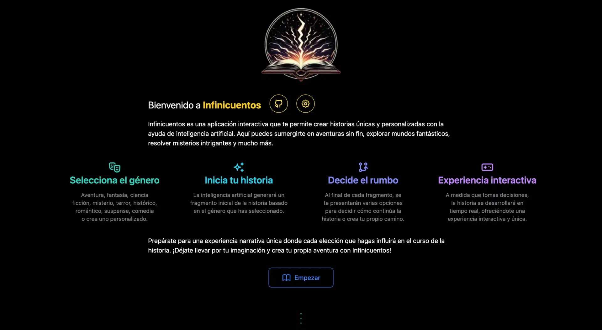

# Infinicuentos

Infinicuentos es una aplicación web que te permite crear historias interactivas personalizadas usando inteligencia artificial. Escoge el género, toma decisiones y vive una experiencia única. La historia se desarrolla en tiempo real a medida que seleccionas las opciones que se te presentan.

## IA API key
Esta aplicación utiliza por defecto el proveedor [Groq](https://groq.com/) usando una 
API key de capa gratuita.
Por lo que pueden ocurrir limitaciones de uso al intentar generar la historia, ya sea 
porque hay muchos usuarios interactuando a la vez o simplemente demasiadas peticiones 
por minuto.

Para evitar esta limitación se ha añadido la funcionalidad de configurar tu propia API 
key. Pulsando el botón de "configuración" que aparece en la parte de la presentación.
Podrás añadir tu API key ya sea de [Groq](https://groq.com/) o de [Openai](https://openai.com/).

## Características

- **Escoge el género:** Aventura, fantasía, ciencia ficción, misterio, terror, histórico, romántico, suspense, comedia o puedes introducir uno personalizado.
- **Comienza tu historia:** La inteligencia artificial generará un fragmento inicial de la historia basado en el género seleccionado.
- **Elige tu camino:** Al final de cada fragmento, se te presentarán varias opciones para decidir cómo continúa la historia o puedes crear otro nuevo.
- **Experiencia interactiva:** A medida que eliges, la historia se desarrollará en tiempo real, creando una experiencia interactiva y única.

## Tecnologías Utilizadas

- **[Astro](https://astro.build/):** Framework para construir sitios web rápidos y modernos.
- **[Vue](https://vuejs.org/):** Framework JavaScript progresivo para construir interfaces de usuario.
- **[Vercel SDK AI](https://vercel.com/docs/ai):** Herramienta para integrar servicios de inteligencia artificial.
- **[Groq](https://groq.com/):** Proveedor de servicios de inteligencia artificial para generación de texto avanzado utilizando el modelo llama3-70b-8192.
- **[Openai](https://openai.com/):** Proveedor de servicios de inteligencia artificial 
  para generación de texto avanzado utilizando el modelo gpt-4o.
- **[Tailwind CSS](https://tailwindcss.com/):** Framework de CSS para construir interfaces de usuario personalizables y modernas.
- **[Flowbite](https://flowbite.com/):** Biblioteca de componentes UI basados en Tailwind CSS.
- **[anime.js](https://animejs.com/):** Biblioteca JavaScript para animaciones.
- **[Tabler Icons](https://tabler-icons.io/):** Conjunto de iconos SVG de código abierto.

## Host Vercel

Este proyecto está hosteado en [Vercel](https://vercel.com/), una plataforma de despliegue y hosting para aplicaciones web estáticas y dinámicas.
Se puede visitar aquí: [infinicuentos.vercel.app](https://infinicuentos.vercel.app/)

## Instalación y Configuración

Para clonar y ejecutar esta aplicación en tu entorno local, sigue estos pasos:

1. **Clonar el repositorio:**

   ```sh
   git clone https://github.com/mpont91/infinicuentos.git
   cd infinicuentos
   ```

2. **Instalar dependencias:**

   ```sh
   npm install
   ```

3. **Configurar variables de entorno:**
   Crea el archivo `.env` en la raíz del proyecto copiando el de ejemplo:

   ```sh
   cp .env.example .env
   ```

   Luego deberás proporcionar la clave de API para Groq.

   ```
   GROQ_API_KEY=your_groq_api_key
   ```

4. **Ejecutar la aplicación:**

   ```sh
   npm run dev
   ```

5. **Visitar en el navegador:**
   Abre `http://localhost:4321` en tu navegador para ver la aplicación en funcionamiento.

## Contribución

¡Las contribuciones son bienvenidas! Si deseas contribuir a este proyecto, por favor sigue estos pasos:

1. **Fork el repositorio**
2. **Crea una rama para tu característica o arreglo de bugs (`git checkout -b feature/tu-feature`)**
3. **Haz commit de tus cambios (`git commit -am 'Agrega nueva característica'`)**
4. **Haz push a la rama (`git push origin feature/tu-feature`)**
5. **Crea un nuevo Pull Request**

## Licencia

Este proyecto está bajo la licencia [MIT](LICENSE).

## Contacto

Para preguntas o comentarios, puedes contactarme a través de [mpont91@gmail.com](mailto:mpont91@gmail.com)

---

¡Gracias por usar Infinicuentos! Esperamos que disfrutes creando tus propias historias interactivas.
